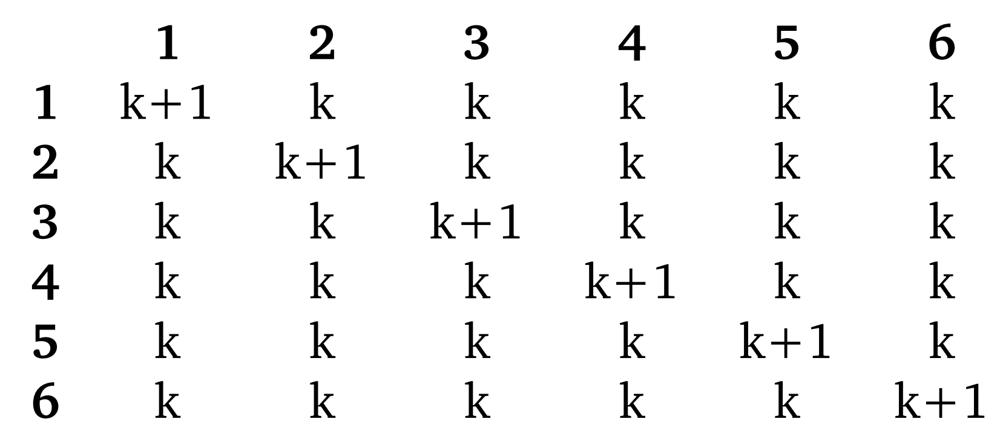

Let's just think about this logically

$k$ increments when the dice rolls are the same(no die is greater than the other)

No die is greater than the other when the dice rolls are the same

The probability of returning k or having 2 different rolls is $ \frac{30}{36} $

On Allah, I swear there's a rule that states that we expect to need 1/p attempts until the thing actually happens? Geometric Distribution?

$ p = \frac{30}{36} $

$ \mathbb{E}(X) = \frac{1}{p} $

$ \mathbb{E}(X) = \frac{1}{ \frac{30}{36}} $

$ \mathbb{E}(X) = \frac{36}{30} $

$ \mathbb{E}(X) = \frac{6}{5} $
